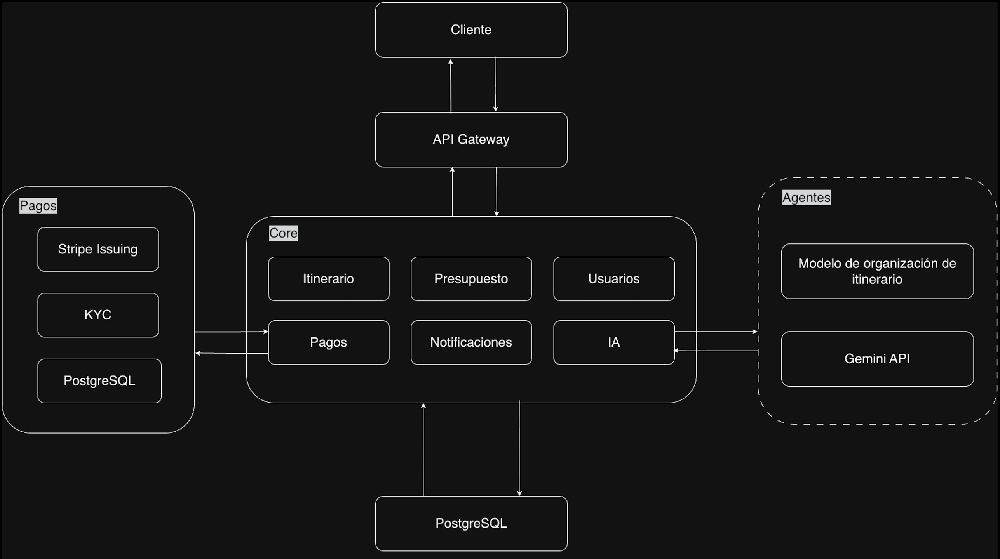
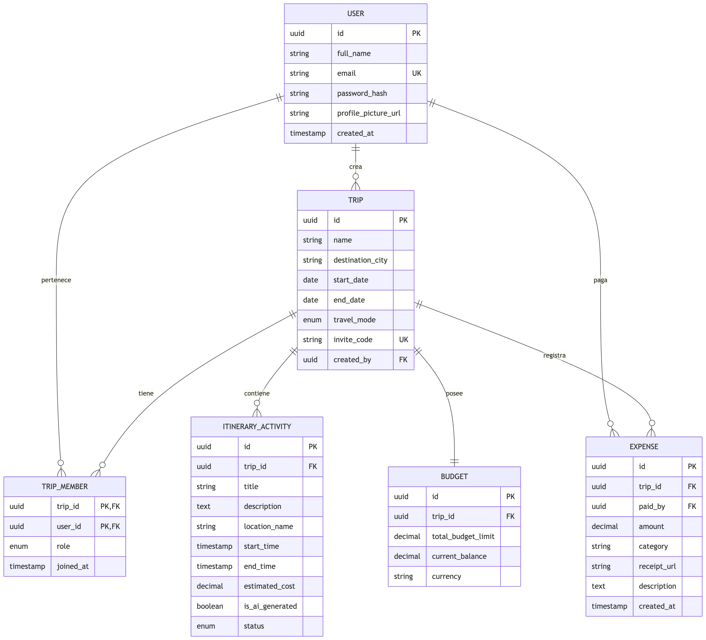

**TravelIn diseño y planeación**

## **Problema a resolver de la API**

Viajar en grupo debería ser una experiencia memorable, pero la realidad es que la coordinación lo arruina antes de que empiece. Los gastos se registran en hojas de cálculo improvisadas, el itinerario vive en un chat de WhatsApp que nadie encuentra, el presupuesto se maneja en otra app, y al final del viaje siempre hay alguien que pagó de más o de menos sin que nadie sepa exactamente por qué.

El problema no es la falta de herramientas, es que están todas separadas. Un viajero promedio usa entre 3 y 5 aplicaciones distintas para organizar un solo viaje, y ninguna de ellas habla con las demás.

## **Arquitectura de la aplicación**

## **Definición de endpoints con notación REST**

#### **Usuarios y Autenticación**

| Método | Endpoint | Descripción |
| :---- | :---- | :---- |
| POST | /api/auth/register | Registro de nuevos viajeros. |
| POST | /api/auth/login | Inicio de sesión y entrega de token (JWT). |
| GET | /api/users/me | Obtener el perfil del usuario actual. |

#### **Viajes**

| Método | Endpoint | Descripción |
| :---- | :---- | :---- |
| POST | /api/trips | Crear un viaje (Aquí defines si es Modo Solo, Amigos o Familia). |
| GET | /api/trips | Listado de todos mis viajes. |
| GET | /api/trips/{id} | Detalle de un viaje específico (info general). |
| POST | /api/trips/{id}/join | Unirse a un viaje grupal mediante un código. |

#### 

#### **Itinerario e IA**

| Método | Endpoint | Descripción |
| :---- | :---- | :---- |
| **POST** | /trips/{id}/itinerary/generate | Dispara el agente de IA para la generación automática del plan inicial. |
| **GET** | /trips/{id}/itinerary | Recupera el listado completo de actividades (generadas y manuales). |
| **POST** | /trips/{id}/itinerary/activities | Permite al usuario agregar manualmente una nueva actividad al itinerario. |
| **PATCH** | /trips/{id}/itinerary/activities/{act\_id} | Modifica una actividad existente (sea de la IA o manual). |
| **DELETE** | /trips/{id}/itinerary/activities/{act\_id} | Elimina una actividad específica del itinerario. |

#### 

#### **Presupuesto y Tarjeta Simulada**

| Método | Endpoint | Descripción |
| :---- | :---- | :---- |
| GET | /api/trips/{id}/budget | Ver estado del fondo común y quién ha pagado qué. |
| POST | /api/trips/{id}/expenses | Registrar un nuevo gasto (dispara la alerta de presupuesto). |
| POST | /api/trips/{id}/payment | Simular el uso de la tarjeta virtual para un pago. |

## 

## 

## **API externa a consumir** 

| API | Función Crítica | Justificación |
| :---- | :---- | :---- |
| Gemini | Razonamiento | Diferenciador principal de la app (itinerario inteligente). |
| TripAdvisor | Contenido | Provee la capa visual y de confianza (fotos y reseñas). |
| Google Maps | Ubicación | Vital para que el usuario sepa dónde están sus actividades. |
| OpenWeather | Logística | Permite que el itinerario sea dinámico y no estático. |

## **Motor de base de datos**

Se ha seleccionado PostgreSQL como motor de base de datos relacional (RDBMS). Esta elección se fundamenta en su capacidad para manejar transacciones complejas con integridad referencial (cumplimiento de propiedades ACID), lo cual es crítico para el módulo financiero y la gestión de presupuestos del sistema.

## **Estrategia de Despliegue y Entornos**

El sistema utiliza una estrategia de paridad de entornos para asegurar que el comportamiento de la base de datos sea consistente desde el desarrollo hasta la producción:

### **Entorno de Producción (AWS):**

Se utiliza Amazon RDS (Relational Database Service) para instanciar PostgreSQL.

* Este servicio gestiona de forma automatizada las copias de seguridad, la aplicación de parches de seguridad y la alta disponibilidad.  
* Permite un escalado vertical de los recursos de almacenamiento y cómputo según la demanda de los usuarios en la fase de lanzamiento.

### **Entorno de Desarrollo (Local):**

Se utiliza la contenedorización mediante Docker para ejecutar una instancia local de PostgreSQL.

* El uso de imágenes oficiales de Docker asegura que la versión del motor, las extensiones y las configuraciones sean idénticas a las utilizadas en Amazon RDS.  
* Esto facilita el aislamiento del entorno de desarrollo y permite a los ingenieros realizar pruebas de esquemas y migraciones de datos de forma segura antes de ser promovidas a la infraestructura de AWS.

### **¿Por qué PostgreSQL?**

* Seguridad de Datos: PostgreSQL ofrece robustez en el manejo de tipos de datos financieros y geográficos (vía PostGIS en etapas futuras).  
* Escalabilidad: La integración nativa con AWS RDS permite que el MVP crezca orgánicamente sin necesidad de migraciones de motor.  
* Portabilidad: Gracias al uso de contenedores en local, el despliegue en la nube se vuelve predecible y reduce los errores de configuración por diferencias de entorno ("it works on my machine").

### **Modelo de datos**

## **Repositorio Github** 

### **Estrategia de ramas**

Para garantizar la estabilidad del código y facilitar el trabajo colaborativo en el desarrollo del MVP, se implementará una metodología de ramificación basada en **Feature Branches** con un flujo de integración continua.

### **1\. Jerarquía de Ramas**

* **`main` (Producción):** Es la rama principal y representa el código estable y desplegado en AWS. Queda estrictamente prohibido realizar *commits* directos en esta rama. Solo acepta cambios provenientes de `develop` mediante un *Pull Request* (PR) aprobado y tras superar las pruebas funcionales.  
* **`develop` (Integración):** Actúa como el eje central de desarrollo. Aquí se integran todas las nuevas funcionalidades terminadas. Es la rama que se utiliza para las pruebas de integración en el entorno de desarrollo.  
* **`feature_##` (Desarrollo de Funcionalidades):** Ramas temporales creadas para trabajar en tareas, *issues* o funcionalidades específicas (donde `##` representa el ID del issue o una descripción breve). Se originan siempre desde `develop`.

### **2\. Flujo de Trabajo (Workflow)**

1. **Creación:** Para iniciar una tarea, el desarrollador crea una rama desde `develop`: `git checkout -b feature_itinerary_logic`  
2. **Desarrollo:** Se realizan los cambios necesarios y se suben al repositorio remoto.  
3. **Pull Request (Hacia Develop):** Una vez terminada la funcionalidad, se abre un *Pull Request* hacia la rama `develop`. Se requiere la revisión de al menos un par (peer review) para asegurar la calidad del código.  
4. **Integración en Develop:** Tras la aprobación, la rama se fusiona con `develop` y se elimina la rama temporal.  
5. **Release a Main:** Cuando `develop` contiene un conjunto de funcionalidades estables listas para el entregable, se realiza un PR de `develop` hacia `main`.

### **3\. Nomenclatura de Ramas**

Se establece una convención estricta para identificar el propósito de cada rama:

| Tipo de Rama | Formato de Nombre | Ejemplo |
| :---- | :---- | :---- |
| **Funcionalidad** | feature\_\#\# o feat\_\#\# | feature\_ia\_agent |
| **Corrección de errores** | fix\_\#\# | fix\_budget\_calc |
| **Documentación** | docs\_\#\# | docs\_api\_endpoints |

### 

### **4\. Reglas de Protección en GitHub**

Para forzar este flujo, se configurarán las siguientes **Branch Protection Rules** en el repositorio:

* **Require a pull request before merging:** Impide subir cambios directos a `main` y `develop`.  
* **Require approvals:** Se necesita al menos una aprobación de otro miembro del equipo.  
* **Dismiss stale pull request approvals:** Si se sube un nuevo cambio al PR, las aprobaciones previas se anulan para forzar una nueva revisión.

